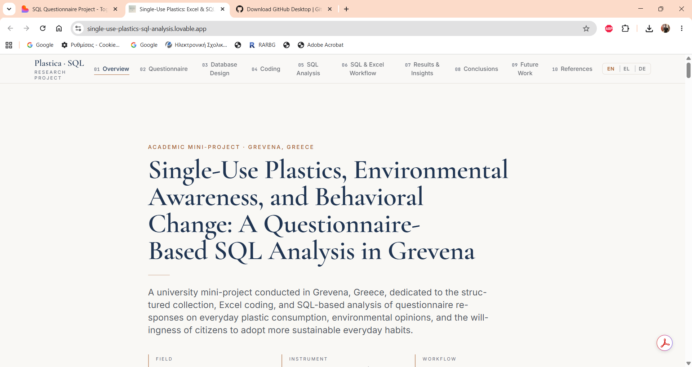
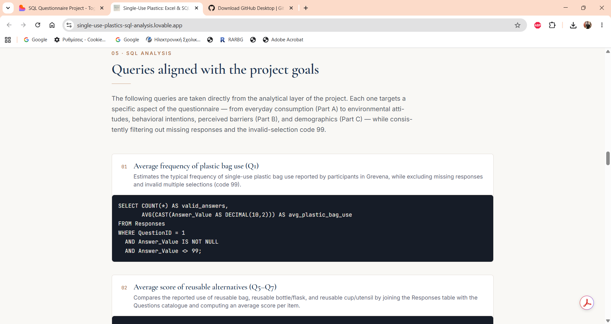
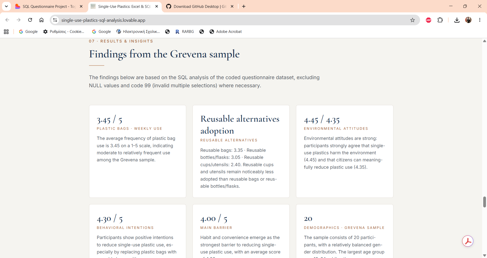
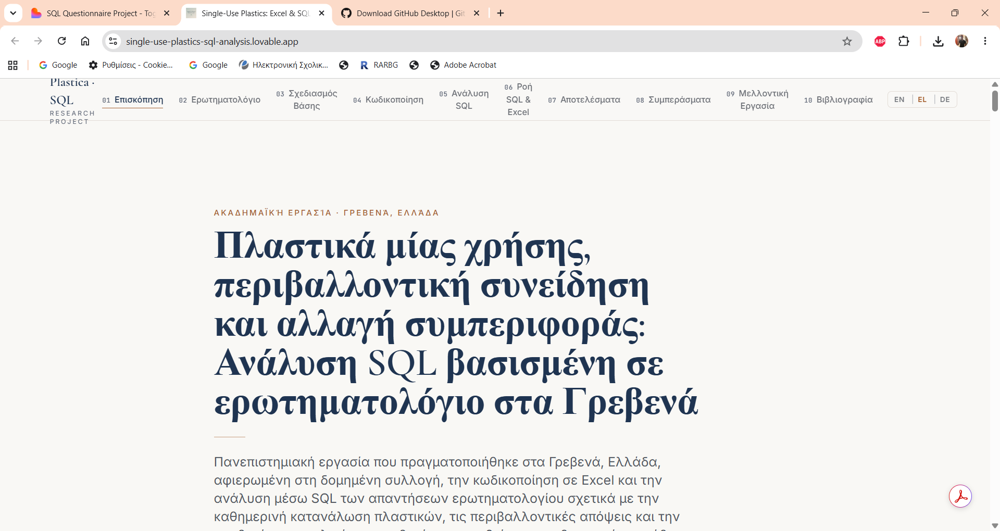

# Single-Use Plastics: Questionnaire-Based Excel and SQL Analysis

A university mini-project examining single-use plastic consumption, environmental awareness, reusable alternatives, behavioral intentions, and perceived barriers among residents of Grevena, Greece.

The project follows a complete data workflow:

**Questionnaire design → Excel coding and validation → Relational database implementation → SQL analysis → Interpretation and multilingual web presentation**

> **Live multilingual website:** [Open the live project](https://single-use-plastics-sql-analysis.lovable.app)

## Website Preview

### Homepage



### SQL Analysis



### Results and Insights



### Greek Version



## Project overview

The study was developed as an academic data-analysis project at the University of Western Macedonia. A structured questionnaire was used to collect responses from a small local sample. The responses were coded in Microsoft Excel, transferred into a normalized SQL Server database, validated, and analyzed with reusable SQL queries.

The repository documents both the research process and the technical implementation.

## Research scope

The questionnaire covers:

1. frequency of single-use plastic consumption;
2. use of reusable alternatives;
3. environmental attitudes and awareness;
4. behavioral intentions to reduce plastic use;
5. perceived barriers to behavioral change;
6. demographic characteristics and consent.

## Dataset summary

|Item|Value|
|-|-:|
|Participants|20|
|Coded questionnaire variables|30|
|Response records|600|
|Geographic focus|Grevena, Greece|
|Analysis type|Descriptive and exploratory|

The dataset is anonymized and uses participant identifiers rather than names or contact details.

### Missing and invalid values

* `NULL` represents a missing response.
* `99` represents an invalid multiple selection in a single-choice item.
* Both values are excluded from numerical aggregates where appropriate.

## Database design

The relational database contains three core tables:

* **Questions** — questionnaire metadata, codes, valid values, thematic groups, and sections;
* **Participants** — one anonymous record for each respondent;
* **Responses** — one coded answer for each participant-question combination.

```text
Participants (1) ─────< Responses >───── (1) Questions
```

Primary and foreign keys preserve referential integrity, while the long-format `Responses` table supports flexible aggregation, filtering, and demographic comparisons.

## Repository structure

```text
single-use-plastics-sql-analysis/
├── README.md
├── sql/
│   ├── 01\_create\_database\_tables.sql
│   ├── 02\_insert\_questions\_participants.sql
│   ├── 03\_insert\_responses.sql
│   ├── 04\_data\_checks.sql
│   └── 05\_analysis\_queries.sql
├── data/
│   └── questionnaire\_dataset.xlsx
├── report/
│   ├── final\_academic\_report.docx
│   └── final\_academic\_report.pdf
├── questionnaire/
│   ├── academic\_questionnaire.docx
│   └── academic\_questionnaire.pdf
└── screenshots/
    └── README.md
```

## SQL workflow

The scripts are designed for **Microsoft SQL Server / SQL Server Management Studio (SSMS)** and should be executed in numerical order:

1. `01\_create\_database\_tables.sql` — creates the database and relational schema;
2. `02\_insert\_questions\_participants.sql` — inserts question metadata and participant identifiers;
3. `03\_insert\_responses.sql` — inserts the 600 coded response records;
4. `04\_data\_checks.sql` — checks counts, missing values, invalid codes, ranges, and joined records;
5. `05\_analysis\_queries.sql` — performs descriptive, thematic, and demographic analyses.

## Example analyses

The SQL analysis includes:

* average frequency of plastic-bag use;
* adoption of reusable bags, bottles/flasks, and cups/utensils;
* environmental-attitude scores;
* behavioral-intention scores;
* strongest perceived barriers;
* demographic frequency distributions;
* average plastic-bag use by age group;
* environmental attitudes by educational level;
* behavioral intentions by gender;
* thematic-group averages and highest/lowest scoring questions.

## Selected findings

|Indicator|Mean score|
|-|-:|
|Plastic-bag use|3.45 / 5|
|Reusable bags|3.35 / 5|
|Reusable bottles/flasks|3.05 / 5|
|Reusable cups/utensils|2.40 / 5|
|Plastics harm the environment|4.45 / 5|
|Citizens can reduce plastic use|4.35 / 5|
|Intention to replace plastic bags|4.30 / 5|
|Habit and convenience as a barrier|4.00 / 5|

The results suggest a potential **attitude-behavior gap**: environmental concern and stated willingness to change are strong, but the adoption of reusable alternatives is uneven and practical habits remain influential.

## Excel workbook

The workbook contains four sheets:

* `DATA\_BASE` — coded responses in wide format;
* `VARIABLE\_DICTIONARY` — variable names, descriptions, types, and thematic groups;
* `CODING\_GUIDE` — numerical coding rules and special-value conventions;
* `LISTS` — controlled value lists used during data preparation.

The Excel workbook is the structured source used to prepare the SQL inserts and to document the questionnaire coding scheme.

## Research limitations

This is a small, non-probability sample of 20 participants. The findings describe the observed sample and must not be generalized to the entire population of Grevena without a larger and more representative study.

The Malaysian study cited in the report is used as an **international literature reference and future comparative direction**, not as a second dataset for direct statistical comparison.

## Tools

* Microsoft Excel
* Microsoft SQL Server
* SQL Server Management Studio
* Microsoft Word
* Lovable — multilingual project website

## Main academic reference

Van, L., Abdul Hamid, N., Ahmad, M. F., Ahmad, A. N. A., Ruslan, R., \& Muhamad Tamyez, P. F. (2021). *Factors of single use plastic reduction behavioral intention*. Emerging Science Journal, 5(3), 269–278. https://doi.org/10.28991/esj-2021-01275

## Author

**Pavlos Zgourelis**  
Department of Statistics  
University of Western Macedonia, Greece

## Usage notice

This repository is published for academic demonstration and portfolio purposes. No open-source license is currently granted for reuse or redistribution of the report, questionnaire, or dataset.

